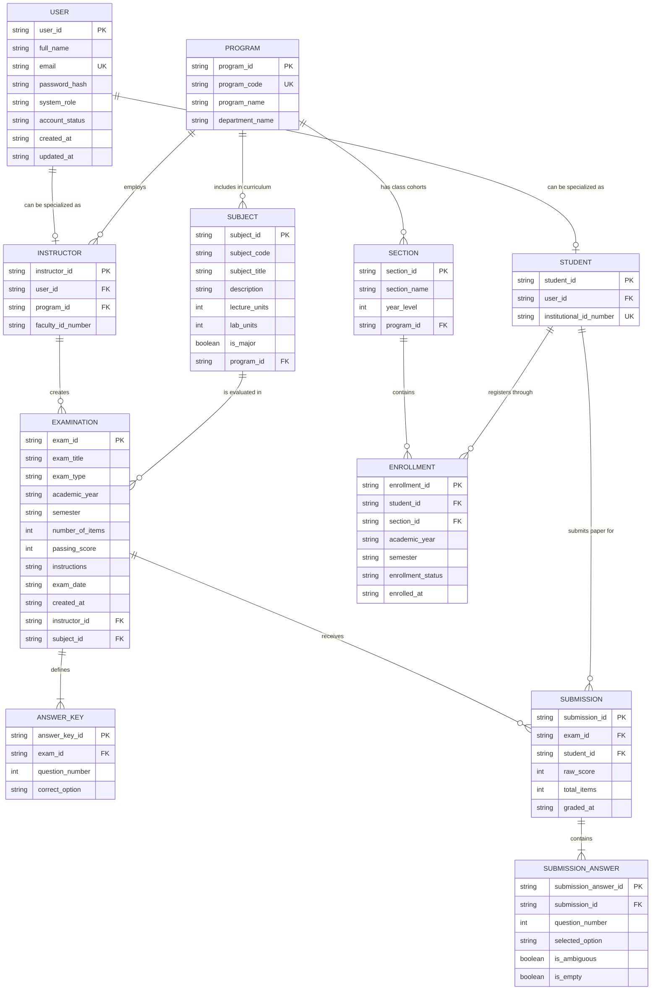

```mermaid
erDiagram
    USER ||--o| INSTRUCTOR : "can be specialized as"
    USER ||--o| STUDENT : "can be specialized as"

    PROGRAM ||--o{ INSTRUCTOR : "employs"
    PROGRAM ||--o{ SUBJECT : "includes in curriculum"
    PROGRAM ||--o{ SECTION : "has class cohorts"

    INSTRUCTOR ||--o{ EXAMINATION : "creates"
    SUBJECT ||--o{ EXAMINATION : "is evaluated in"

    SECTION ||--o{ ENROLLMENT : "contains"
    STUDENT ||--o{ ENROLLMENT : "registers through"

    EXAMINATION ||--|{ ANSWER_KEY : "defines"
    EXAMINATION ||--o{ SUBMISSION : "receives"
    STUDENT ||--o{ SUBMISSION : "submits paper for"

    SUBMISSION ||--|{ SUBMISSION_ANSWER : "contains"

    USER {
        string user_id PK
        string full_name
        string email UK
        string password_hash
        string system_role
        string account_status
        string created_at
        string updated_at
    }

    PROGRAM {
        string program_id PK
        string program_code UK
        string program_name
        string department_name
    }

    INSTRUCTOR {
        string instructor_id PK
        string user_id FK
        string program_id FK
        string faculty_id_number
    }

    STUDENT {
        string student_id PK
        string user_id FK
        string institutional_id_number UK
    }

    SUBJECT {
        string subject_id PK
        string subject_code
        string subject_title
        string description
        int lecture_units
        int lab_units
        boolean is_major
        string program_id FK
    }

    SECTION {
        string section_id PK
        string section_name
        int year_level
        string program_id FK
    }

    ENROLLMENT {
        string enrollment_id PK
        string student_id FK
        string section_id FK
        string academic_year
        string semester
        string enrollment_status
        string enrolled_at
    }

    EXAMINATION {
        string exam_id PK
        string exam_title
        string exam_type
        string academic_year
        string semester
        int number_of_items
        int passing_score
        string instructions
        string exam_date
        string created_at
        string instructor_id FK
        string subject_id FK
    }

    ANSWER_KEY {
        string answer_key_id PK
        string exam_id FK
        int question_number
        string correct_option
    }

    SUBMISSION {
        string submission_id PK
        string exam_id FK
        string student_id FK
        int raw_score
        int total_items
        string graded_at
    }

    SUBMISSION_ANSWER {
        string submission_answer_id PK
        string submission_id FK
        int question_number
        string selected_option
        boolean is_ambiguous
        boolean is_empty
    }
```
