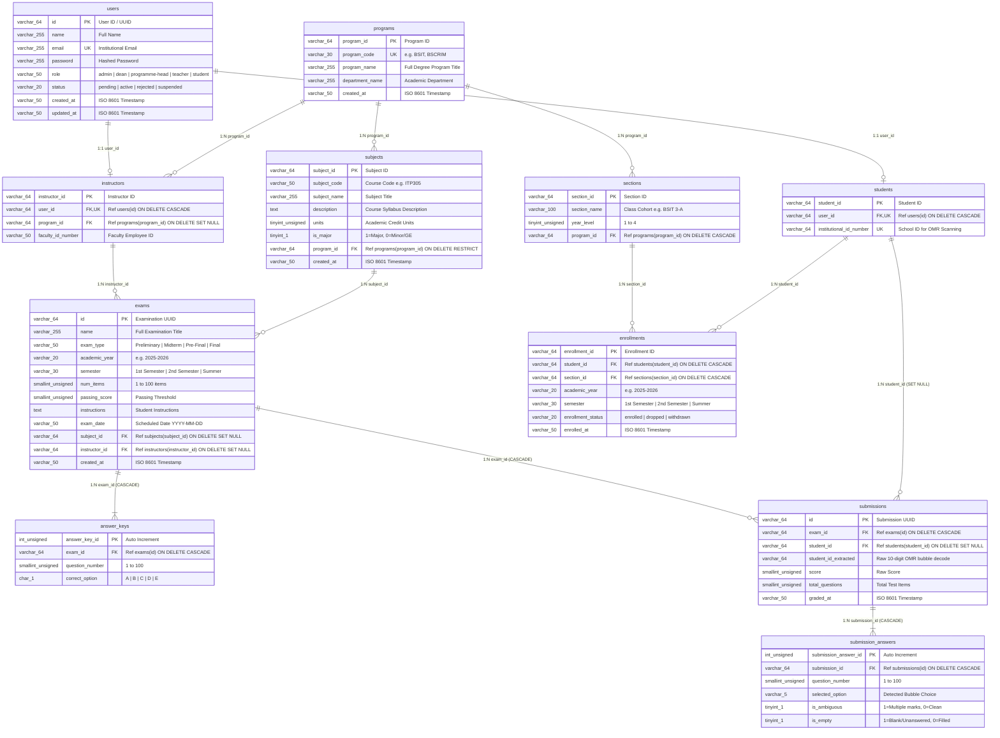

```mermaid

erDiagram
    users ||--o| instructors : "1:1 user_id"
    users ||--o| students : "1:1 user_id"

    programs ||--o{ instructors : "1:N program_id"
    programs ||--o{ subjects : "1:N program_id"
    programs ||--o{ sections : "1:N program_id"

    instructors ||--o{ exams : "1:N instructor_id"
    subjects ||--o{ exams : "1:N subject_id"

    sections ||--o{ enrollments : "1:N section_id"
    students ||--o{ enrollments : "1:N student_id"

    exams ||--|{ answer_keys : "1:N exam_id (CASCADE)"
    exams ||--o{ submissions : "1:N exam_id (CASCADE)"
    students ||--o{ submissions : "1:N student_id (SET NULL)"

    submissions ||--|{ submission_answers : "1:N submission_id (CASCADE)"

    users {
        varchar_64 id PK "User ID / UUID"
        varchar_255 name "Full Name"
        varchar_255 email UK "Institutional Email"
        varchar_255 password "Hashed Password"
        varchar_50 role "admin | dean | programme-head | teacher | student"
        varchar_20 status "pending | active | rejected | suspended"
        varchar_50 created_at "ISO 8601 Timestamp"
        varchar_50 updated_at "ISO 8601 Timestamp"
    }

    programs {
        varchar_64 program_id PK "Program ID"
        varchar_30 program_code UK "e.g. BSIT, BSCRIM"
        varchar_255 program_name "Full Degree Program Title"
        varchar_255 department_name "Academic Department"
        varchar_50 created_at "ISO 8601 Timestamp"
    }

    instructors {
        varchar_64 instructor_id PK "Instructor ID"
        varchar_64 user_id FK,UK "Ref users(id) ON DELETE CASCADE"
        varchar_64 program_id FK "Ref programs(program_id) ON DELETE SET NULL"
        varchar_50 faculty_id_number "Faculty Employee ID"
    }

    students {
        varchar_64 student_id PK "Student ID"
        varchar_64 user_id FK,UK "Ref users(id) ON DELETE CASCADE"
        varchar_64 institutional_id_number UK "School ID for OMR Scanning"
    }

    subjects {
        varchar_64 subject_id PK "Subject ID"
        varchar_50 subject_code "Course Code e.g. ITP305"
        varchar_255 subject_name "Subject Title"
        text description "Course Syllabus Description"
        tinyint_unsigned units "Academic Credit Units"
        tinyint_1 is_major "1=Major, 0=Minor/GE"
        varchar_64 program_id FK "Ref programs(program_id) ON DELETE RESTRICT"
        varchar_50 created_at "ISO 8601 Timestamp"
    }

    sections {
        varchar_64 section_id PK "Section ID"
        varchar_100 section_name "Class Cohort e.g. BSIT 3-A"
        tinyint_unsigned year_level "1 to 4"
        varchar_64 program_id FK "Ref programs(program_id) ON DELETE CASCADE"
    }

    enrollments {
        varchar_64 enrollment_id PK "Enrollment ID"
        varchar_64 student_id FK "Ref students(student_id) ON DELETE CASCADE"
        varchar_64 section_id FK "Ref sections(section_id) ON DELETE CASCADE"
        varchar_20 academic_year "e.g. 2025-2026"
        varchar_30 semester "1st Semester | 2nd Semester | Summer"
        varchar_20 enrollment_status "enrolled | dropped | withdrawn"
        varchar_50 enrolled_at "ISO 8601 Timestamp"
    }

    exams {
        varchar_64 id PK "Examination UUID"
        varchar_255 name "Full Examination Title"
        varchar_50 exam_type "Preliminary | Midterm | Pre-Final | Final"
        varchar_20 academic_year "e.g. 2025-2026"
        varchar_30 semester "1st Semester | 2nd Semester | Summer"
        smallint_unsigned num_items "1 to 100 items"
        smallint_unsigned passing_score "Passing Threshold"
        text instructions "Student Instructions"
        varchar_50 exam_date "Scheduled Date YYYY-MM-DD"
        varchar_64 subject_id FK "Ref subjects(subject_id) ON DELETE SET NULL"
        varchar_64 instructor_id FK "Ref instructors(instructor_id) ON DELETE SET NULL"
        varchar_50 created_at "ISO 8601 Timestamp"
    }

    answer_keys {
        int_unsigned answer_key_id PK "Auto Increment"
        varchar_64 exam_id FK "Ref exams(id) ON DELETE CASCADE"
        smallint_unsigned question_number "1 to 100"
        char_1 correct_option "A | B | C | D | E"
    }

    submissions {
        varchar_64 id PK "Submission UUID"
        varchar_64 exam_id FK "Ref exams(id) ON DELETE CASCADE"
        varchar_64 student_id FK "Ref students(student_id) ON DELETE SET NULL"
        varchar_64 student_id_extracted "Raw 10-digit OMR bubble decode"
        smallint_unsigned score "Raw Score"
        smallint_unsigned total_questions "Total Test Items"
        varchar_50 graded_at "ISO 8601 Timestamp"
    }

    submission_answers {
        int_unsigned submission_answer_id PK "Auto Increment"
        varchar_64 submission_id FK "Ref submissions(id) ON DELETE CASCADE"
        smallint_unsigned question_number "1 to 100"
        varchar_5 selected_option "Detected Bubble Choice"
        tinyint_1 is_ambiguous "1=Multiple marks, 0=Clean"
        tinyint_1 is_empty "1=Blank/Unanswered, 0=Filled"
    }
```
